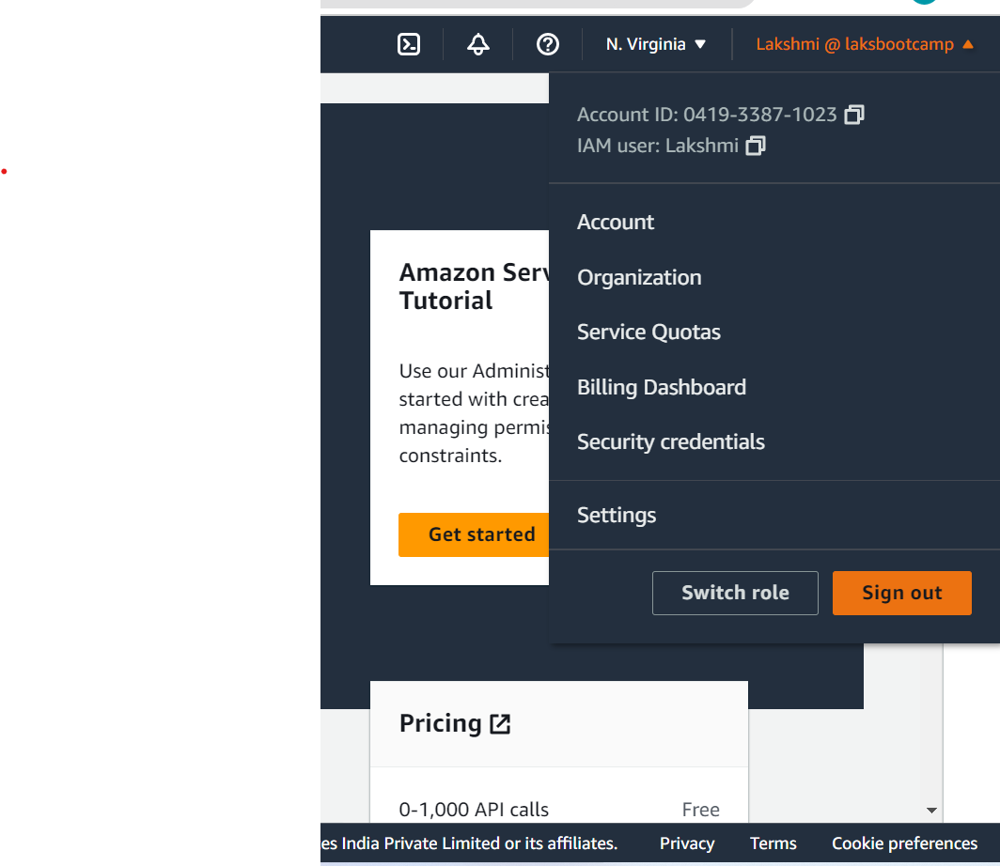
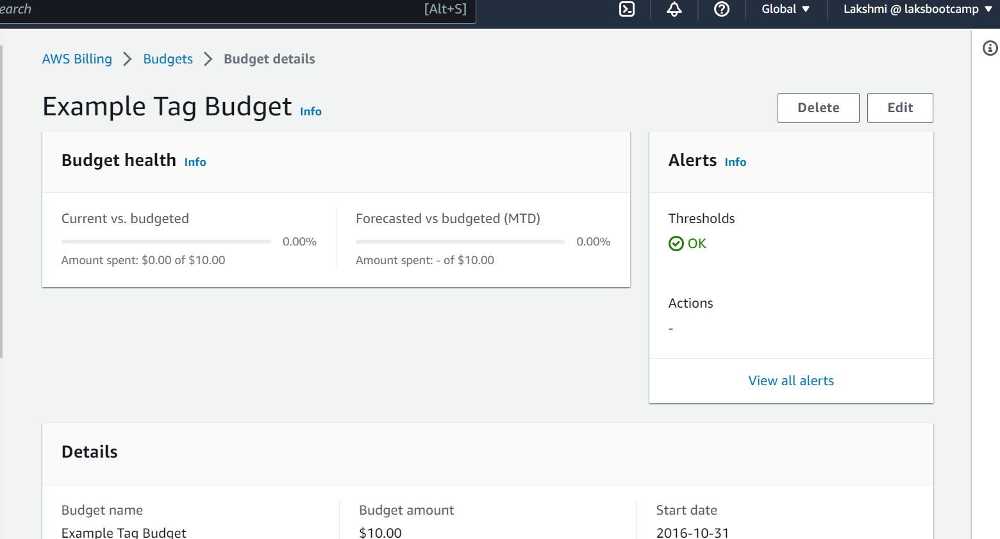
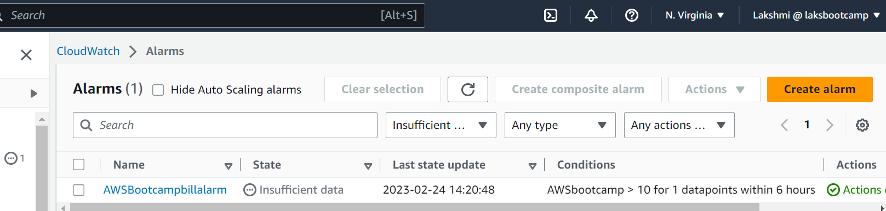

# Week 0 — Billing and Architecture 
## Home work
  - created IAM Admin user
    
  - Created billing alarm
    
  - created cloud watch monitoring for bill
    
  - created an AWS organization and added an account
    
      - Image of the architectural diagram can be found below
    
          
